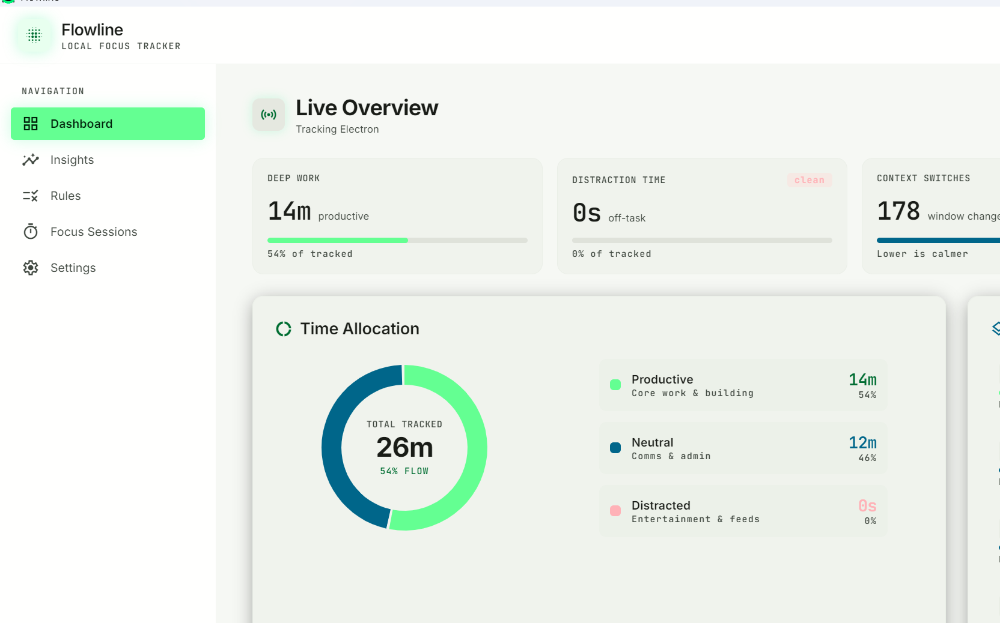

# Flowline

**See your focus. Stay in flow.**

Flowline is a local-first desktop app that tracks how you spend time across Windows apps and browser tabs, then turns it into a live focus dashboard. It categorizes activity as **productive**, **neutral**, or **distracting**, detects idle time, nudges you when you drift, and includes Pomodoro sessions, daily goals, and streaks. A companion Chrome extension adds accurate per-site tracking. Built with Electron, React, and SQLite — **all your data stays on your device**.



## Features

- **Automatic activity tracking** — event-driven foreground-window detection (no busy polling), with a light heartbeat for idle and duration.
- **Accurate browser tracking** — an optional Chrome/Edge extension reports the active tab so time is attributed to the real domain (e.g. `youtube.com`), not just the window title.
- **Smart categorization** — ~80 sensible default rules out of the box; fully editable. Match by app (`.exe`), domain, or title keyword.
- **Live dashboard** — deep-work total, distraction time, context switches, active session, a time-allocation ring, top apps, and a live activity stream.
- **Insights** — intra-day focus flux chart and a categorized application breakdown.
- **Focus sessions** — Pomodoro-style blocks (15/25/50 min) with break reminders.
- **Goals, streaks & weekly report** — daily deep-work target with a running streak and a 7-day bar view.
- **Idle (AFK) detection** — time away from the keyboard isn't counted.
- **Distraction alerts** — a notification after a configurable stretch of continuous off-task time.
- **Export** — one-click CSV or JSON of your activity.
- **System tray + launch on login** — keeps tracking quietly in the background.
- **Dark / light / system theme.**

## How it works

- The main process subscribes to Windows foreground-window changes (`SetWinEventHook` via `@paymoapp/active-window`) and records an event whenever the active window or its title changes.
- A ~20s heartbeat checks idle time (`powerMonitor`) and flushes the duration of long, switch-free windows.
- For browsers, the **Flowline Bridge** extension pushes the active tab's URL to the app over a local WebSocket (`ws://127.0.0.1:7413`); when present, time is attributed to the exact domain. Without it, browser time falls back to window-title heuristics.
- Everything is stored in a local SQLite database in your user-data folder. Nothing leaves your machine.

## Tech stack

Electron · Vite · React · TypeScript · Tailwind CSS · Recharts · better-sqlite3 · ws · electron-builder (NSIS).

## Getting started

> **Windows + Node 24 note:** Node 24 bundles a `common.gypi` that forces the ClangCL MSBuild toolset, which breaks a plain `npm install` when compiling native modules. The native modules only need building against Electron's ABI, so use the setup script below instead of `npm install`.

```powershell
# Install deps and build native modules for Electron
npm run setup:win

# Run in development
npm run dev

# Build production bundles
npm run build

# Package a Windows installer (NSIS .exe)
npm run dist:win
```

`npm run setup:win` runs:

```powershell
npm install --ignore-scripts
node node_modules/electron/install.js
npx electron-rebuild -f
```

## Browser extension (optional, recommended)

1. Open `chrome://extensions` and enable **Developer mode**.
2. Click **Load unpacked** and select the `browser-extension/` folder.
3. It auto-connects to `ws://127.0.0.1:7413`. The header shows **Browser Linked** when connected.

## Configuration

Open **Settings** in the app to adjust:

- Idle threshold, heartbeat interval, and distraction-alert duration.
- Daily deep-work target and distraction limit (drives goals and streaks).
- Notifications and launch-on-login.

## Project structure

```
src/
  main/         Electron main process
    tracking/   active-window subscription, idle heartbeat, categorizer
    browser/    local WebSocket bridge for the extension
    db/         SQLite schema, seed rules, queries
    ipc/        typed IPC handlers
  preload/      contextBridge API
  renderer/     React UI (Dashboard, Insights, Rules, Sessions, Settings)
  shared/       shared types, IPC channel names, date-range helpers
browser-extension/   Chrome (MV3) companion extension
```

## Privacy

Flowline is **local-first**: all tracking data is stored in a SQLite file on your device and is never uploaded. The browser extension talks only to `localhost`.

## License

Intended for release under the **MIT License**. All runtime dependencies are MIT-licensed.
